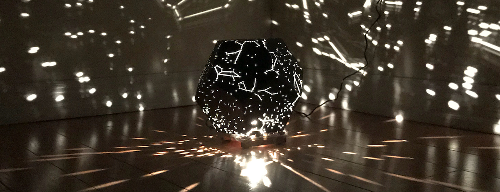

# Star Projector

This readme needs work but it should at least be informative.

## About

This application is a tool to generate a 3D preview and 2D laser-cutting
template of custom selections of stars and constellations projected onto a
regular polyhedron of your choice. Stars data comes from actual astrometric
catalogues and includes accurate positions and enables filtering based on
apparent brightness.

Projecting onto a regular polyhedron (a 3D shape in which all faces are the
same) means we can easily "un-fold" the projected results into a 2D template for
cutting and then re-fold that into a physical 3D shape.

The final result is effectively a lamp shade, allowing a light source (ideally
very small, bright, and omni-directional) to project individual points of light
onto the walls and ceiling of a room.

## Usage

### Customization

The tool will start up with default selections for the target shape, minimum
brightness level, and constellations. Any of these can be modified to and the
results will be re-projected in the preview pane automatically. 

**Note:** the full catalogue includes over 98k stars. Not only can it take quite
a while to project the entire selection, but most of them are very faint stars
(meaning you likely wouldn't recognize them) and they would be bunched very
close together. The latter can be especially problematic due to overlapping
cuts: without manual (tedious!) cleanup you could end up with a ring of
connected stars causing a section of the projector to be unintentionally cut
out. Think of the island in a stencil of the letter "O".

The list of constellations is pre-filtered to only count those that are
"interesting". The full list maps out 88 constellations and you might be
surprised how many of them look like a simple line. My filter requires that a
constellation includes at least one star that connects to at least 3 other
stars.

You can visualize what it's like to unfold the 3D shape by clicking on it. It
looks neat but doesn't actually serve much of a purpose.

### Cutting

The easiest way to turn this into something real is to work with a local laser
cutting service and use some kind of heavy paper (I've had success with bristol
board). I have made a few attempts using a consumer-grade vinyl cutter but still
need to find the right mix of paper weight, blade settings, and polygon size. In
either case, the final output of this tool is a vector template that will
determine cutting and scoring lines for the polyhedron itself as well as
geometry like star shapes and constellation lines.

Among the star/constellation customizations on the left you have options to
determine the size of the output template based on dimensions of your material,
the desired real-life radius of your projector, or edge length of each polygon
face. You can also choose whether to keep the unfolded net intact or to split it
up into separate SVG files for individual polygons. The latter gives you the
opportunity to arrange them more efficiently or to maximize the size of your
output in an otherwise limited paper or cutter size. It also means you have more
tabs to align and glue together afterwards: for the time being you are
responsible for figuring out how things fit together.

## Acknowledgements

The star catalogue is a compilation of the _Hippcarcos_,_Yale Bright Star
Catalog_, and _Gliese Catalog of Nearby Stars_ collected and organized in the
[HYG](http://www.astronexus.com/hyg) Database.

The list of constellations was painstakingly compiled by Daniel Plemmons for a
really cool [VR Planetarium](http://blog.leapmotion.com/introducing-planetarium-design-science-behind-vr-widgets-showcase/).
